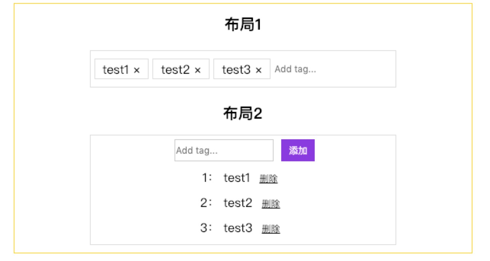

# RenderLess Components

### 文章引用

[在 vue.js 中使用函数式组件](https://adamwathan.me/renderless-components-in-vuejs/)

### 函数式组件

函数式组件，意味着该组件无状态（没有响应式数据视图），无实例，因为没有视图渲染，因而渲染开销很低。大部分情况下用来包裹组件，配合作用域插槽，可以达到高阶组件的效果，用来分离视图渲染和业务逻辑非常有效，是一个值得注意的特性。

### 项目介绍

这个项目就是一个函数式组件使用的实例，分离了业务逻辑数据处理和视图渲染逻辑，使得一个组件可以应对不同种情况的布局。有需要的话可以下载下来运行看看，学习一下。

### 使用方式

代码下载下来之后，运行以下命令即可查看效果
`npm install && npm run dev`

### 项目截图

